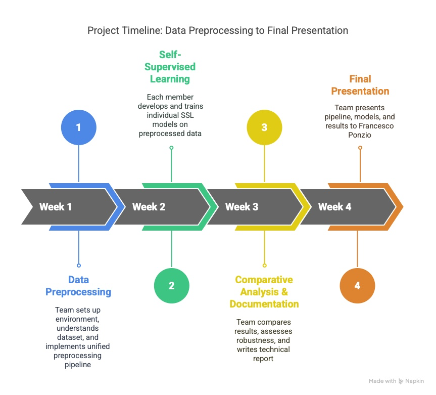

# Project Timeline: Data Preprocessing to Final Presentation

> **Note:** This planner is only an estimate of the timing and may be adjusted as needed.

---

## Implementation Plan  

1. **Phase 1 – Data Preprocessing (Week 1)**  
   - Install & configure environment (libraries, viewers)  
   - Explore dataset structure & labels  
   - Design & test tile‐extraction & automatic labeling pipeline  
   - Agree on unified pipeline end‐of‐week  

2. **Phase 2 – Self‐Supervised Learning (Week 2)**  
   - Each member selects and implements two SSL algorithms  
   - Train models independently on the unified data  

3. **Phase 3 – Comparative Analysis & Documentation (Week 3)**  
   - Collect and compare SSL metrics  
   - Implement supervised CNN & transfer‐learning baselines in parallel  
   - Draft the technical report  

4. **Phase 4 – Final Presentation (Week 4)**  
   - Finalize report and slides  
   - Demo code & results  
   - Present to Prof. Francesco Ponzio  

